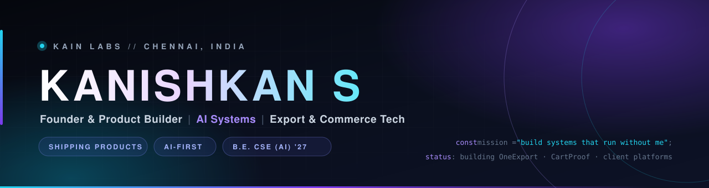

<div align="center">
  
</div>

<div align="center">

<a href="https://linkedin.com/in/kanishkan-s"></a>

<a href="https://github.com/Kk4747?tab=followers"></a>

</div>

<br>

<div align="center">
  
</div>

---

## 🧭 &nbsp;About Me

```typescript
const kanishkan = {
  role:      "Founder & Product Builder",
  brand:     "KAIN Labs",
  location:  "Chennai, India 🇮🇳",

  building: [
    "OneExport — AI Export Operating System for Indian SMEs",
    "CartProof — Shopify Conversion OS (Hesitation AI)",
    "Client platforms: retail ERP, B2B portals, academy SaaS",
  ],

  studying: [
    "B.E. Computer Science (AI) @ Sathyabama — Class of 2027",
    "Exchange semester @ National Taipei University of Technology",
    "Computer Vision, Applied LLMs, Systems & Leverage",
  ],

  stack: {
    frontend: ["Next.js 15", "React", "TypeScript", "Tailwind v4", "shadcn/ui"],
    backend:  ["Node.js", "FastAPI", "Supabase", "PostgreSQL"],
    ai:       ["PyTorch", "TensorFlow", "YOLO", "OpenCV", "LLM pipelines"],
    hardware: ["Raspberry Pi", "ESP32", "Arduino"],
  },

  focus: "Products that compound — not hours that trade.",
};
```

> *Build the business so it runs without you. Then build the next one.*

---

## 🚀 &nbsp;Currently Building

<table>
  <tr>
    <td width="33%" valign="top" align="center">
      <h3>🚢 OneExport</h3>
      
      <p>AI-powered Export Operating System for Indian SME exporters — deal-centric, compliance-aware, built for last-mile execution.</p>
    </td>
    <td width="33%" valign="top" align="center">
      <h3>🛒 CartProof</h3>
      
      <p>Shopify Conversion Operating System with a <b>Hesitation AI</b> core — heading for the Shopify App Store.</p>
    </td>
    <td width="33%" valign="top" align="center">
      <h3>🦾 Wrist Assist</h3>
      
      <p>Wrist-worn assistive device for blind users — YOLO object search with haptic directional guidance.</p>
    </td>
  </tr>
</table>

---

## 🛠️ &nbsp;Featured Projects

| Project | What it is | Stack | Status |
|:--|:--|:--|:--|
| **OneExport** | Export OS for Indian SME exporters — 22 modules, 29 routes | `Next.js 15` `TypeScript` `Tailwind v4` `TanStack` | 🟢 Active build |
| **CartProof** | Shopify conversion optimization app | `Shopify App` `React` `Node.js` | 🟣 Pre-launch |
| **Retail OS** *(client)* | Multi-branch retail ops platform + AI BI dashboard for a South India electronics chain | `Next.js` `Supabase` `PostgreSQL` | 🟢 Active build |
| **Dealer Portal** *(client)* | B2C + B2B furniture dealer portal, Zoho One integrated | `Next.js` `Zoho One` | 🟢 Active build |
| **Academy Suite** *(client)* | Multi-surface gym & martial-arts academy management platform | `Next.js` `Supabase` | 🔵 Design + spec |
| **Agri-Export Brand** *(client)* | GI-tagged agricultural brand — 17-section web audit + rebuild | `Audit` `Web` `SEO` | 🔵 Scoped |
| **Wrist Assist (FYP)** | Assistive CV device — YOLO + haptics | `Python` `OpenCV` `YOLO` `Raspberry Pi` | 🟠 Prototype |

<sub>🔒 Most of these are private client builds. Repo links go up as projects become public — happy to walk through any of them.</sub>

---

## 🔗 &nbsp;Connect With Me

<div align="center">

<a href="https://linkedin.com/in/kanishkan-s"></a>
<a href="https://github.com/Kk4747"></a>

</div>

---

## 💻 &nbsp;Tech Stack

<div align="center">

**Languages & Core**


**Frontend**


**Backend & Data**


**AI / ML / Vision**


**Hardware & Systems**


**Tooling**


<br><br>


</div>

---

## 📊 &nbsp;GitHub Analytics

<div align="center">


<br><br>


</div>

---

## 🏆 &nbsp;Highlights

<div align="center">


<br>


</div>

---

## 🎓 &nbsp;Certifications & Experience

<table>
  <tr>
    <td width="50%" valign="top">

**Certifications**

- Oracle Cloud Infrastructure — **Generative AI** Professional
- Oracle Cloud Infrastructure — **Data Science** Professional
- Oracle Cloud Infrastructure — **AI Foundations** Associate
- DeepLearning.AI — **AI For Everyone**
- FIEO — **International Trade Management** *(Ministry of Commerce)*
- Microsoft × LinkedIn — **Career Essentials in Generative AI**
- Forage — **Accenture Data Analytics**, **BCG GenAI**
- HP LIFE — **Digital Business Skills**

  </td>
    <td width="50%" valign="top">

**Experience & Achievements**

- 🇹🇼 **International exchange semester** — National Taipei University of Technology, Taiwan
- 🔬 **Exchange researcher** — haptics & VR interaction
- 💼 **Technology & Business Intern** — Sprint6 Specialized Services *(smart-restroom IoT analytics)*
- 🎤 **Student Coordinator & Community Leader** — Sathyabama; launched the Toastmasters Club & Next Gen Empowerment seminar
- 🌏 AI × ESG Youth City Forum · Circular Economy Workshop, Taipei
- 🥋 **Combat sports** — medalled competitor

  </td>
  </tr>
</table>

---

<div align="center">

### 💡 What I'm looking for

`Founder collaborations` &nbsp;·&nbsp; `Hackathons` &nbsp;·&nbsp; `Accelerators & incubators` &nbsp;·&nbsp; `AI / deep-tech build partners`

<br>


<br><br>


</div>
